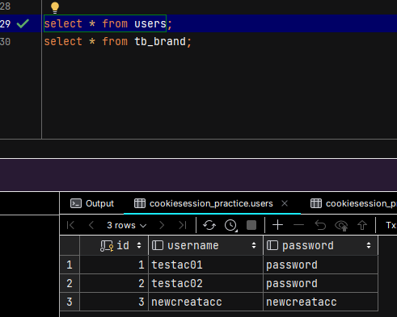

# 說明

* 本練習係學習Cookie與Seesion的實用並進行實作，共包含6個練習如下：
  * Cookie部分：
    * 練習1：新增Cookie至用戶瀏覽器
    * 練習2：從用戶瀏覽器獲取Cookie
  * Seesion部分：
    * 練習3：服務器獲取Session對象並設置屬性進行儲存
    * 練習4：服務器獲取並返回Session對象屬性值
    * 練習5：服務器調用invalidate()方法銷毀Session
  * 綜合練習：
    * 練習6：結合Cookie與Session實作用戶登入及註冊
      * 運用Cookie完成用戶登入階段自動帶入帳號密碼的功能
      * 運用Session顯示用戶登入歡迎資訊，及用戶註冊驗證碼輸入比對功能
      * 本練習已內建兩組帳號密碼如下：
        * 帳號：testac01 密碼：password
        * 帳號：testac02 密碼：password
* 各部分練習實作結果如圖：
  * 練習測試頁首頁：
    * 
  * 練習1：
    * 
    * 
    * 
  * 練習2：
    * 
  * 練習3：
    * 
    * 
  * 練習4：
    * 
    * 
  * 練習5：
    * 
    * 
  * 練習6：
    * 
    * 
    * 
    * 
    * 
    * 
    * 
    * 
    * 
    * 
    * 
    * 
    * 
    * 
    * 
    * 
